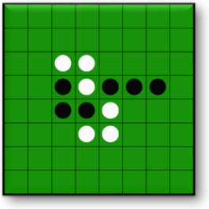

# Othello Bot

Othello is a two player game where each person alternate placing black or white chips are placed on certain squares on a traditional 8 by 8 board. When a chip of certain color is placed, all chips of opposite color will be flipped. The goal is to end the game (when all squares are filled or there are no legal moves) with the greater number of chips of your color.



To run the program, call:
```python3 othello.py```